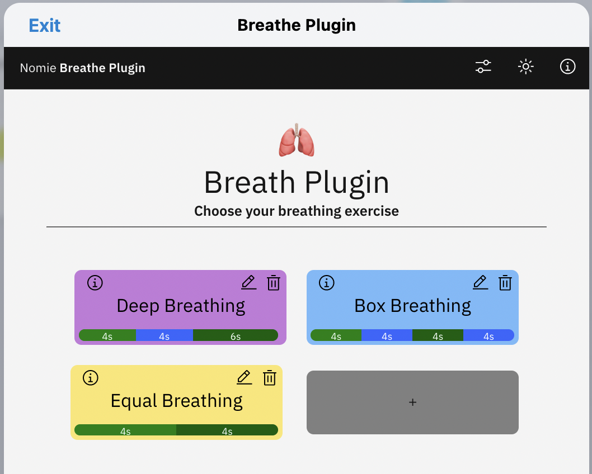
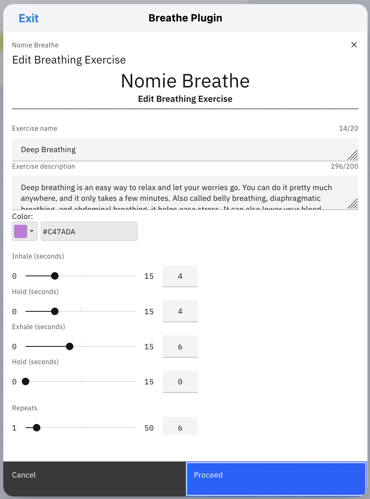
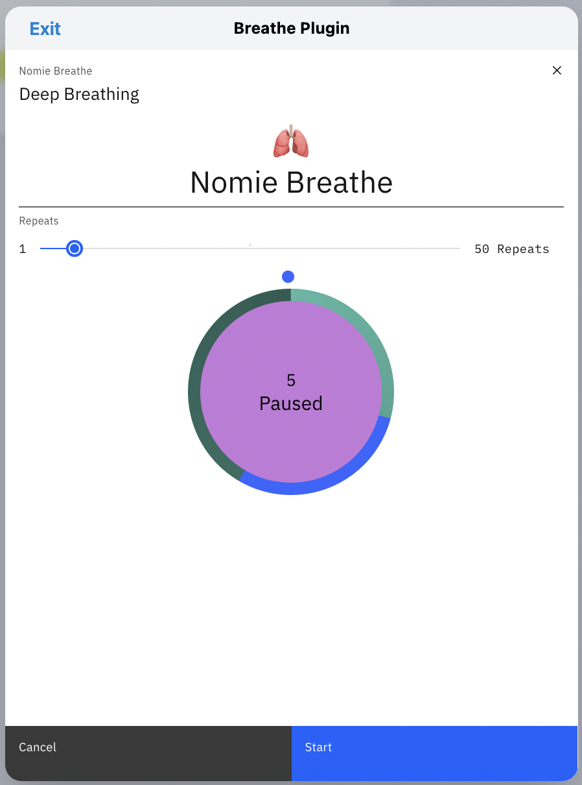
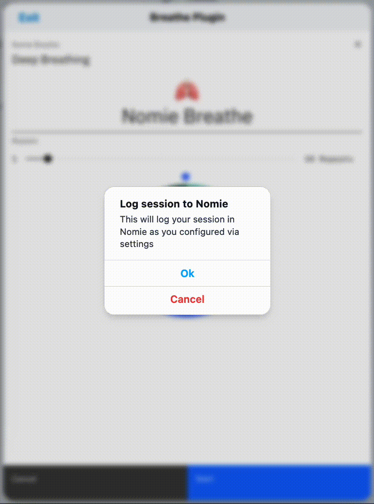
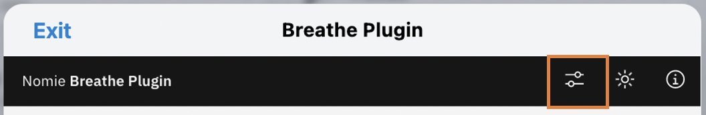
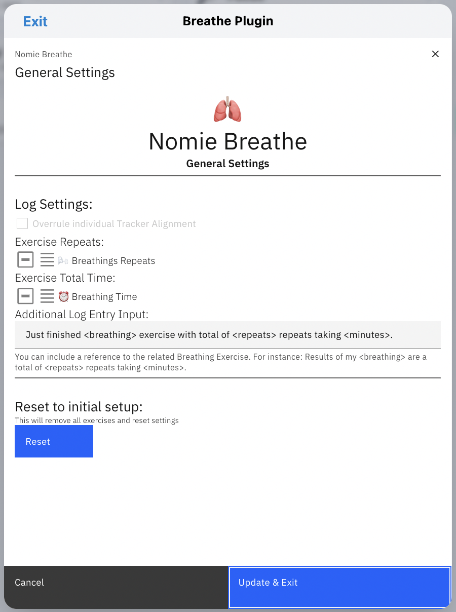

# 🫁Nomie Breathe Plugin

The 🫁Nomie Breathe Plugin is a plugin for Nomie6-oss.

## About the 🫁Nomie Breathe Plugin

The Nomie Breathe Plugin will support your breathing exercises with guided breathings. You can choose to use one of the predefined exercises or you can create your own.

When the exercise is completed the plugin can autmatically log your results (duration and repeats) to the Nomie Trackables of your choice.

## Installing the Plugin

The url of the plugin is:

[https://dailynomie.github.io/nomie-plugin-breathe/](https://dailynomie.github.io/nomie-plugin-breathe/)

The 🫁Nomie Breathe Plugin can be installed in Nomie via the following steps:

* Go to the More Tab
* Select Plugins
* Click the + or Add Custom Plugin
* Provide the url for the plugin
* Tap Install Plugin

## Using the Plugin

After launching the plugin, you will be presented with the main screen. This creen will show all you selected pre-defined exercises and/or your own defined breathings.

### Editing an Exercise

By clicking on the edit button you can change the main parameters of the selected breathing:

Most of the options are self explanatory. The Inhale/Hold/Exhale/Hold section will define the duration of each step per breathing cycle.

The Repeats section defines the amount of repeats for the above defined cycle.

Once ready with editing you can select the 'Proceed' button.

### Starting an exercise

You can start an exercise by clicking on one of the selected breathings on the main screen. You will see the following screen:

Before you click the start button, you can still change the amount of repeats. Once clicked, the exercise will start and you will be guided by the animated circle:

When the exercise is finished (and defined in your configuration settings) you can automatically log your achievements in Nomie:

## Configuring the Plugin

The settings of the plugin can be changed via the 'settings' button at the top of the screen:

You will be presented with the following options:

First of all you can define to which Trackables the duration and the repeats will be logged after you finsihed an exercise. In above example I log my results in the Trackables 'Breathings Repeats' & 'Breathing Time'

You can also include some additional text in your log/note. Within this text you can use the keywords breathing, repeats and minutes to represent these parameters from the exercise you just finished. Please make sure to include these keywords between <>.

The final Reset option is descructive 😄 It will reset the plugin and remove all your predefined exercises on the main screen.

Well, I guess there is nothing more to explain.

As always...have fun with it!
